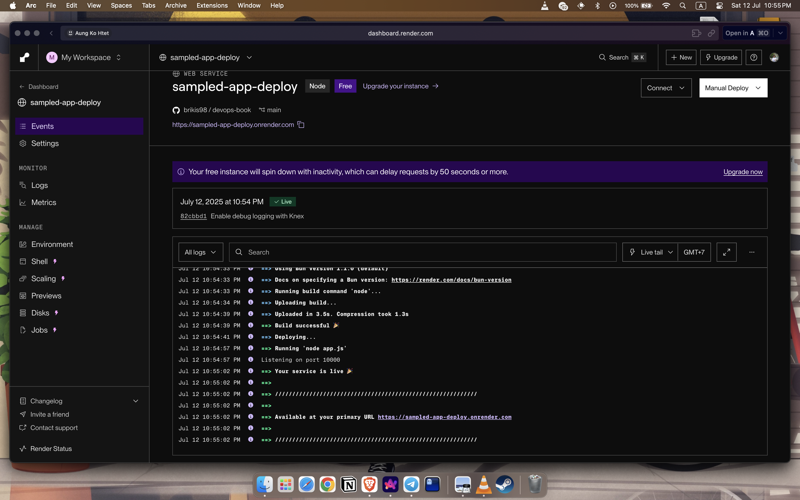
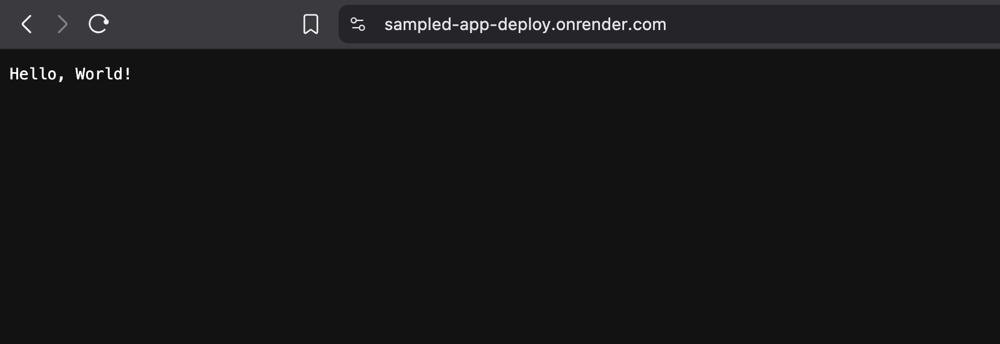

# Deploy an App via PaaS (Render)
- Add your repo choose web services and run eployment process

- As a result, while many projects start on PaaS, if they grow
big enough and require more control, they end up
migrating to IaaS.
